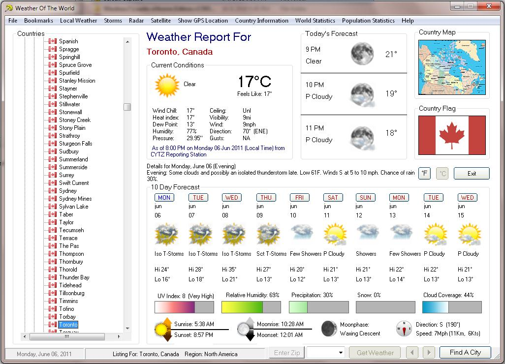



## Weather Of The World

### Description

This is the ultimate in weather program, Weather of the World will give you detail weather of all the countries in world plus detail facts about that country, GPS location and more. if there are missing file please email me and i will send to you.

Please vote
 
### More Info
 

             |
---                |---
**Submitted On**   |2011-06-09 22:32:18
**By**             |[Kenneth Dillon](https://github.com/Planet-Source-Code/PSCIndex/blob/master/ByAuthor/kenneth-dillon.md)
**Level**          |Intermediate
**User Rating**    |5.0 (10 globes from 2 users)
**Compatibility**  |VB 5\.0, VB 6\.0
**Category**       |[Complete Applications](https://github.com/Planet-Source-Code/PSCIndex/blob/master/ByCategory/complete-applications__1-27.md)
**World**          |[Visual Basic](https://github.com/Planet-Source-Code/PSCIndex/blob/master/ByWorld/visual-basic.md)
**Archive File**   |[Weather\_Of220609692011\.zip](https://github.com/Planet-Source-Code/kenneth-dillon-weather-of-the-world__1-73942/archive/master.zip)

